<!-- ━━━━━━━━━━━━━━━━━━━━━━━━ BANNER ━━━━━━━━━━━━━━━━━━━━━━━━ -->

  

<!-- ━━━━━━━━━━━━━━━━━━━━━━━━ GAME ━━━━━━━━━━━━━━━━━━━━━━━━ -->
<h3 align="center">🎮 Catch the Bug</h3>

  <em>Un bug viaja hacia producción. Atrápalo con los comandos correctos del pipeline antes de que sea tarde.</em>

  

<!-- ━━━━━━━━━━━━━━━━━━━━━━━━ INFOGRAPHIC ━━━━━━━━━━━━━━━━━━━━━━━━ -->
<h3 align="center">🧭 How I build: Risk-Driven Development × QA × Observability</h3>

  <em>Una sola idea: priorizar por riesgo, no por cobertura uniforme. QA baja la probabilidad de fallo, Observability baja el tiempo de detección, y el análisis de riesgo decide dónde invertir.</em>

  

<!-- ━━━━━━━━━━━━━━━━━━━━━━━━ SOCIALS ━━━━━━━━━━━━━━━━━━━━━━━━ -->
<h3 align="center">🌐 Find me</h3>

  
  &nbsp;
  

  Made with ❤️ + SVG + CSS · <code>~/jipg</code>

